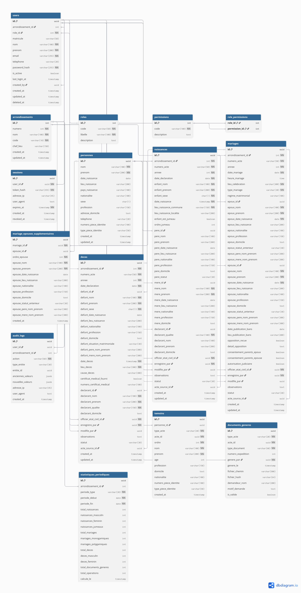
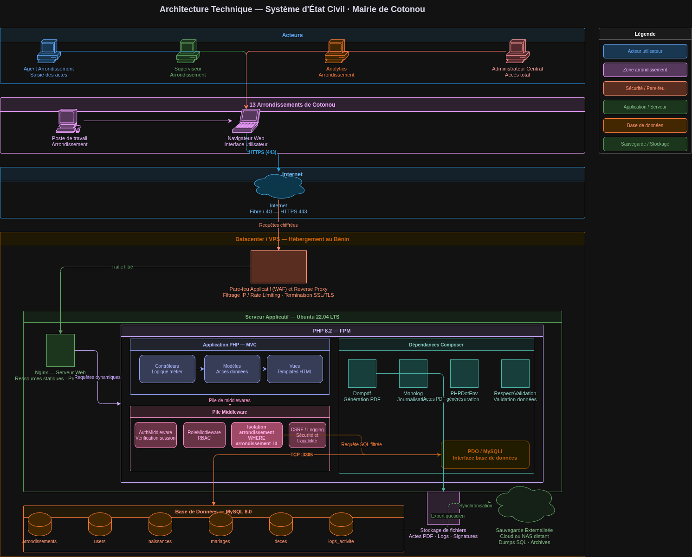

# État Civil — Mairie de Cotonou

Outil de gestion numérique des actes d'état civil (naissances, mariages, décès) pour les 13 arrondissements de Cotonou.

---

## Stack

| | |
|---|---|
| Backend | PHP 8.2 natif (MVC maison, PDO) |
| Base de données | MySQL 8+ |
| PDF | Dompdf 2.x |
| Front | CSS custom, vanilla JS |
| Déploiement | Docker (Render) + MySQL managé (Railway) |

---

## Lancer en local

**Prérequis :** PHP 8.1+, MySQL 8+, Composer

```bash
git clone https://github.com/aboudou-cto-bloko/etat-civil-cotonou.git
cd etat-civil-cotonou
composer install
cp .env.example .env
# éditer .env avec tes paramètres MySQL
mysql -u root -p -e "CREATE DATABASE etat_civil_cotonou CHARACTER SET utf8mb4 COLLATE utf8mb4_unicode_ci;"
php database/migrate.php
php -S localhost:8000 -t public/
```

Compte admin par défaut :  
`admin@etatcivil-cotonou.bj` / `Admin@Cotonou2026`

---

## Déploiement (Render + Railway MySQL)

1. Créer un projet sur Railway → ajouter le plugin **MySQL** → copier les variables de connexion
2. Sur Render → **New Web Service** → connecter le repo GitHub → Render détecte le `Dockerfile` automatiquement
3. Ajouter les variables d'environnement dans Render :

```env
APP_ENV=production
APP_URL=https://<ton-app>.onrender.com
SESSION_SECURE=true
MYSQLHOST=<Railway host>
MYSQLPORT=<Railway port>
MYSQLDATABASE=<Railway db>
MYSQLUSER=<Railway user>
MYSQLPASSWORD=<Railway password>
```

4. Cliquer **Deploy** — la migration tourne automatiquement au démarrage. Chaque push sur `main` redéploie.

---

## Rôles

| Rôle | Périmètre | Ce qu'il peut faire |
|---|---|---|
| `admin` | Tous les arrondissements | Tout — actes, stats, utilisateurs |
| `superviseur` | Son arrondissement | Enregistrer et modifier les actes |
| `analytics` | Son arrondissement | Statistiques en lecture seule |

L'isolation par arrondissement est appliquée côté serveur — impossible d'accéder aux données d'un autre arrondissement par URL.

---

## Base de données

15 tables — [voir le diagramme en ligne](https://dbdiagram.io/d/etat-civil-69e762e1d80a958d1c9a1d60)



Points notables :
- UUID comme clé primaire sur les tables transactionnelles (actes, personnes, users)
- Actes **jamais supprimés** — statuts `ACTIF / RECTIFIÉ / ANNULÉ / DISSOUS`
- Table `personnes` mutualisée entre naissances, mariages et décès
- Support du mariage polygamique (table `mariage_epouses_supplementaires`, Art. 143 Loi n°2002-07)
- Audit log append-only avec snapshot JSON avant/après chaque modification

---

## Sécurité

- Mots de passe hachés bcrypt (coût 12)
- Protection CSRF sur tous les formulaires (dont la déconnexion)
- Limitation des tentatives de connexion : 5 essais max, blocage 5 min
- Détection d'IP via `TRUSTED_PROXIES` (pas de confiance aveugle au header `X-Forwarded-For`)
- Headers HTTP : `CSP`, `HSTS`, `X-Frame-Options`, `X-Content-Type-Options`, `Referrer-Policy`
- Requêtes SQL préparées (PDO, zéro concaténation)
- Redirections limitées au même domaine (pas d'open redirect)
- Logs d'audit sur connexions, déconnexions et actions métier

---

## Architecture cible (production)



Le schéma se lit de haut en bas en 5 couches :

**1. Acteurs**
Quatre profils utilisateur accèdent au système : l'agent arrondissement (saisie des actes), le superviseur arrondissement (validation et consultation), l'analytics arrondissement (statistiques en lecture seule) et l'administrateur central (accès global à tous les arrondissements).

**2. Poste de travail → Internet**
Chaque agent se connecte depuis un poste de travail dans son arrondissement via un navigateur web. La communication transite par Internet (fibre ou 4G) en HTTPS sur le port 443 — toutes les données sont chiffrées en transit.

**3. Datacenter / VPS — hébergement au Bénin**
Le premier point d'entrée est un **pare-feu applicatif (WAF) couplé à un reverse proxy Nginx**. Il filtre les IP malveillantes, applique du rate limiting, et assure la terminaison SSL/TLS. Nginx sert les ressources statiques directement (CSS, JS, images) et transfère les requêtes dynamiques vers PHP-FPM.

**4. Serveur applicatif — Ubuntu 22.04 LTS**
C'est là que tourne l'application. La couche PHP 8.2-FPM héberge trois sous-composants :

- **Application MVC** : les contrôleurs traitent la logique métier, les modèles accèdent aux données via PDO, les vues génèrent le HTML retourné au navigateur.
- **Pile de middlewares** : chaque requête traverse une chaîne — `AuthMiddleware` vérifie la session, `RoleMiddleware` contrôle les droits (RBAC), l'**isolation arrondissement** injecte un filtre `WHERE arrondissement_id` dans toutes les requêtes SQL pour cloisonner les données, puis CSRF et logging assurent la sécurité et la traçabilité.
- **Dépendances Composer** : Dompdf pour la génération des actes PDF officiels, Monolog pour la journalisation, PHPDotEnv pour la configuration, Respect/Validation pour la validation des données saisies.

La communication avec la base de données passe par TCP sur le port 3306 via l'interface PDO/MySQLi.

**5. Base de données — MySQL 8.0**
Six tables sont représentées : `arrondissements`, `users`, `naissances`, `mariages`, `deces`, `logs_activite`. En parallèle, un stockage de fichiers conserve les actes PDF générés, les logs applicatifs et les signatures. Un export quotidien alimente une **sauvegarde externalisée** (cloud ou NAS distant) contenant les dumps SQL et les archives.

Config minimale recommandée : 4 cœurs, 8 Go RAM, 200 Go SSD.
